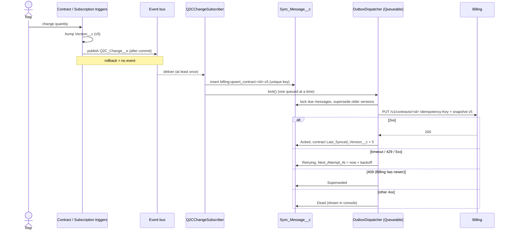
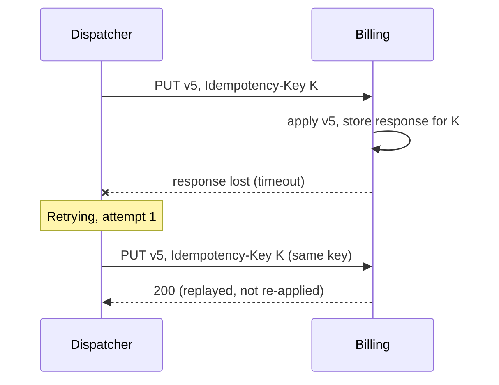
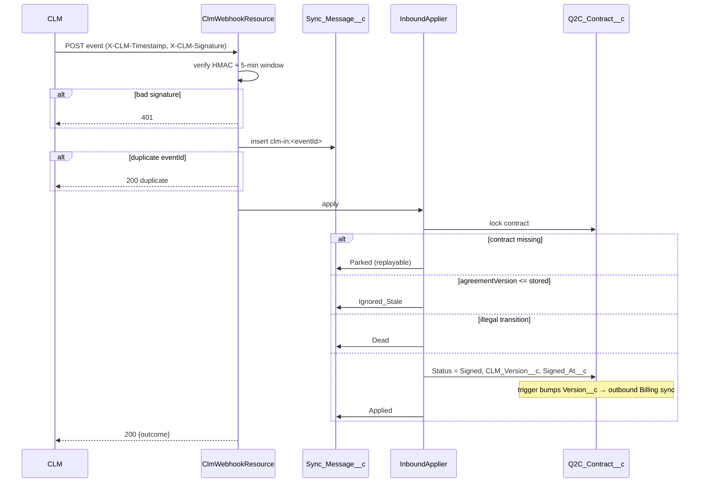
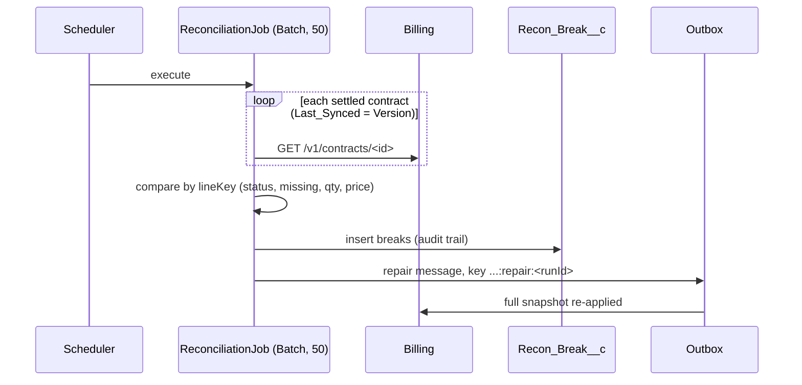
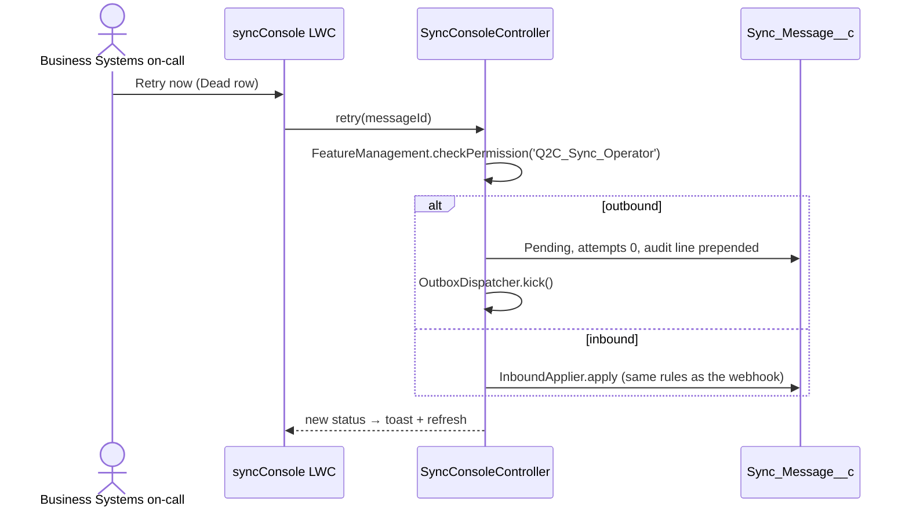

# Sequences

## Outbound: a priced change reaches Billing

```mermaid
sequenceDiagram
    actor Rep
    participant T as Contract / Subscription triggers
    participant Bus as Event bus
    participant Sub as Q2CChangeSubscriber
    participant O as Sync_Message__c
    participant D as OutboxDispatcher (Queueable)
    participant B as Billing
    Rep->>T: change quantity
    T->>T: bump Version__c (v5)
    T->>Bus: publish Q2C_Change__e (after commit)
    Note over T,Bus: rollback = no event
    Bus-->>Sub: deliver (at least once)
    Sub->>O: insert billing:upsert_contract:<id>:v5 (unique key)
    Sub->>D: kick() (one queued at a time)
    D->>O: lock due messages, supersede older versions
    D->>B: PUT /v1/contracts/<id> Idempotency-Key + snapshot v5
    alt 2xx
        B-->>D: 200
        D->>O: Acked, contract Last_Synced_Version__c = 5
    else timeout / 429 / 5xx
        D->>O: Retrying, Next_Attempt_At = now + backoff
    else 409 (Billing has newer)
        D->>O: Superseded
    else other 4xx
        D->>O: Dead (shown in console)
    end
```

## Retry after a lost response

```mermaid
sequenceDiagram
    participant D as Dispatcher
    participant B as Billing
    D->>B: PUT v5, Idempotency-Key K
    B->>B: apply v5, store response for K
    B--xD: response lost (timeout)
    Note over D: Retrying, attempt 1
    D->>B: PUT v5, Idempotency-Key K (same key)
    B-->>D: 200 (replayed, not re-applied)
```

## Inbound: CLM signature

```mermaid
sequenceDiagram
    participant L as CLM
    participant W as ClmWebhookResource
    participant M as Sync_Message__c
    participant A as InboundApplier
    participant C as Q2C_Contract__c
    L->>W: POST event (X-CLM-Timestamp, X-CLM-Signature)
    W->>W: verify HMAC + 5-min window
    alt bad signature
        W-->>L: 401
    end
    W->>M: insert clm-in:<eventId>
    alt duplicate eventId
        W-->>L: 200 duplicate
    end
    W->>A: apply
    A->>C: lock contract
    alt contract missing
        A->>M: Parked (replayable)
    else agreementVersion <= stored
        A->>M: Ignored_Stale
    else illegal transition
        A->>M: Dead
    else
        A->>C: Status = Signed, CLM_Version__c, Signed_At__c
        Note over C: trigger bumps Version__c → outbound Billing sync
        A->>M: Applied
    end
    W-->>L: 200 {outcome}
```

## Nightly reconciliation

```mermaid
sequenceDiagram
    participant S as Scheduler
    participant R as ReconciliationJob (Batch, 50)
    participant B as Billing
    participant X as Recon_Break__c
    participant O as Outbox
    S->>R: execute
    loop each settled contract (Last_Synced = Version)
        R->>B: GET /v1/contracts/<id>
    end
    R->>R: compare by lineKey (status, missing, qty, price)
    R->>X: insert breaks (audit trail)
    R->>O: repair message, key ...:repair:<runId>
    O->>B: full snapshot re-applied
```

## Operator retry

```mermaid
sequenceDiagram
    actor Op as Business Systems on-call
    participant UI as syncConsole LWC
    participant Ctl as SyncConsoleController
    participant O as Sync_Message__c
    Op->>UI: Retry now (Dead row)
    UI->>Ctl: retry(messageId)
    Ctl->>Ctl: FeatureManagement.checkPermission('Q2C_Sync_Operator')
    alt outbound
        Ctl->>O: Pending, attempts 0, audit line prepended
        Ctl->>Ctl: OutboxDispatcher.kick()
    else inbound
        Ctl->>O: InboundApplier.apply (same rules as the webhook)
    end
    Ctl-->>UI: new status → toast + refresh
```
